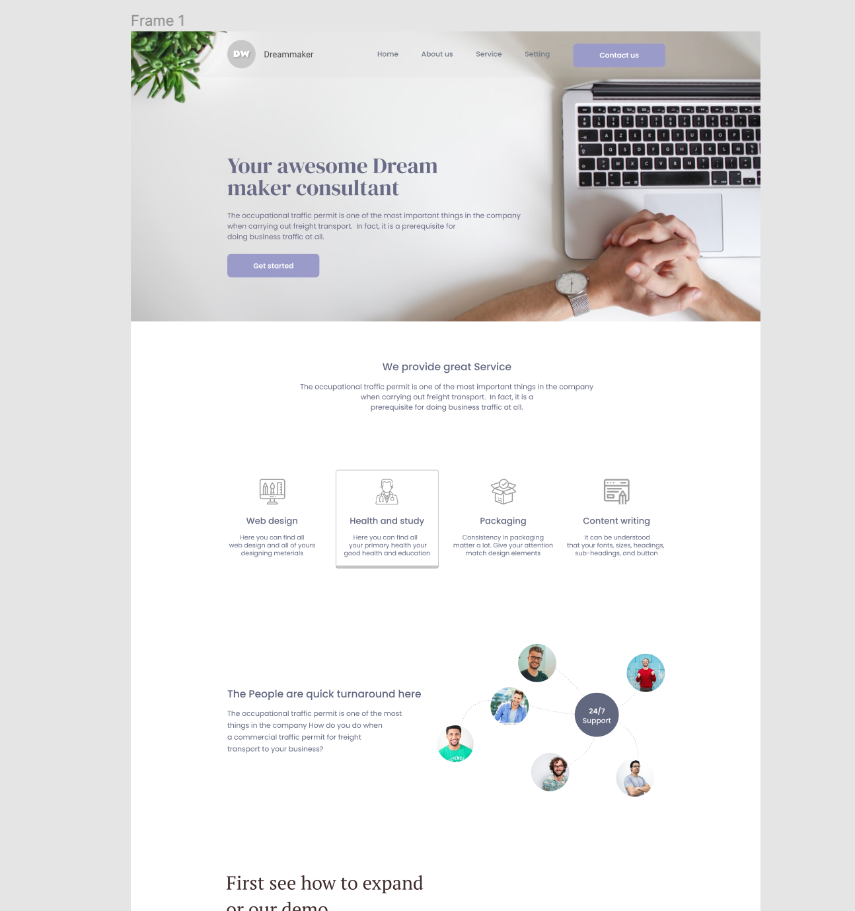

Create a copy of Landing Page using the attached mockup file.
===============================

Requirements:
----------------
- Create the Landing Page for Desktop view
- Create the Landing Page for Mobile view
- Respect exactly the provided layout
- Deploy the project towards Netlify (www.netlify.com) connected to your GitHub Repo
- Provide the navigation of FAQ section with sample data and animations
- "Load More" button should load additional sample data
- "Featured" section should provide a slide experience with sample data
- Login section should do a basic validation with error management
- The page should have an efficient SEO level
- After the project is deployed, analyze it with https://web.dev

Knowledge Required for the Project:
----------------
- Basic HTML
- CSS Flexbox
- CSS Animations and transitions
- Responsiveness Rules
- SVG integration
- Rounded Images
- External Fonts integration
- Figma Usage
- SEO rules and Metatags
- Javascript syntax and function to handle: accordions, sliders, form validation

Before starting any of the tasks in this Learning Path, please READ the following rules
===============================

What do you need to start this Learning Path:
----------------
1. A GitHub account
3. A Local IDE or Editor
5. Git Environment
6. A http://toggl.com/ account and Chrome Extension
7. A Netlify account

Rules that you MUST follow:
----------------
- **Fork this repo into your own Github Account** as a **public** Repository
- **Create a Github Project** connected to the repository
- Read **carefully** the task description
- Analyze the task, and **create relative subtasks** to track any requirement and knowledge needed
- **Assign an estimate to each created subtask**
- Define a **deadline for the main task**
- **Provide a Flowchart within the project**
- Where required, involve other members of the community to support you on the development
- When working on a task, move it to the **In progress** column and start tracking it
- After each task completion, **move it to the "Done" column** and stop tracking it
- After the main task completion, share the solution (e.g. your GitHub repo) over the community

Following some useful materials for your work:
----------------

[Git and GitHub configuration and usage](https://www.loom.com/share/6b86aa3bc0aa4f2d88a315bc9d3209c4)

[Pseudo Code Methodology](https://wtmatter.com/pseudocode/)

